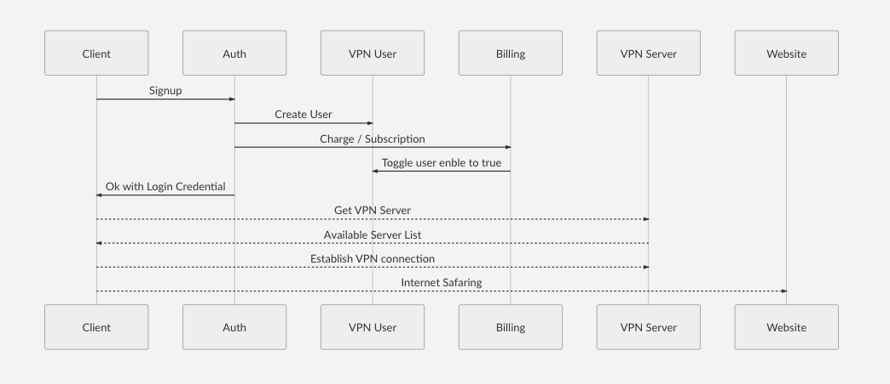

# vpn-as-a-service


# Overview



# Using API

API: ```https://api.atspeeds.com/:endpoint```

## Endpoint vpn user ##

* `POST /signup`: User SIGNUP
   
** Request Body
   
       | Name            | Type            | Description                           |
       |-----------------|------------------|---------------------------------------|
       | userId              | uuid             | phone number                         |
       | userPass            | BASE64           | user Password in BASE64   |
       | domain              | String           | Domain name               |
       
       
Example of Request body JSON
        
   ```{ 
	"userId": "13600000003",
	"userPass": "c3RhY2thYnVzZS5jb20=",
	"domain": "33vpn.com"
	}```
   
   
   
Example of Respons body 
   
        
   ```{
	"credential": {
		"domain": "33vpn.com",
		"userId": "13600000008",
		"userPass": "c3RhY2thYnVzZS5jb20=",
		"username": "13600000008",
		"password": "f2wq6A"
	},
	"results": "success"
	}`
	
       
	| Name            | Type            | Description                           |
	|-----------------|------------------|---------------------------------------|
	| results          | string             | success or failed                        |
	| credential        | Object           | Object of user credential   |
	| username        | string | username for ikv2 vpn service        |
	| password        | string                 | password for ikv2 vpn service         |
       
       
   
   * `POST /login`: User LOGIN
        Request Body
   
       | Name            | Type            | Description                           |
       |-----------------|------------------|---------------------------------------|
       | userId              | uuid             | phone number                         |
       | userPass            | BASE64           | user Password in BASE64   |
       | domain              | String           | Domain name               |
       
       
       Example of Request body JSON
        
       ```{ 
	      "userId": "13600000003",
	      "userPass": "c3RhY2thYnVzZS5jb20=",
              "domain": "33vpn.com"
       }```
   
   
       Example of Respons body 
        
       ```{
              "result": "success",
              "credential": {
              "username": "13600000008",
              "password": "f2wq6A",
              "active": 0,
              "protocol": "IKEv2",
              "vpn_remote_id": "vpn.atspeeds.com",
              "server_address_url": "https://api.atspeeds.com/servers"
               },
              "jwt":"<jwt_token>"
         }```


       | Name            | Type            | Description                           |
       |-----------------|------------------|---------------------------------------|
       | results          | string             | success or failed                        |
       | credential        | Object           | Object of user credential   |
       | username        | string | username for ikv2 vpn service        |
       | password        | string                 | password for ikv2 vpn service         | 
       | active        | Boolean                 | user status for billing usage         |  
       | protocol        | String                 | VPN protocol         |  
       | vpn_remote_id        | String                 | VPN remote_id         |  
       | server_address_url        | URL                 | A url to get the list of VPN servers         |  
       | JWT        | JWT token                 | JWT token for further usage         |  


   * `GET /servers`: Return list of VPN servers
   
     Example response
   
     ```{
         "servers": [
             "hk.node.atspeeds.com"
             ]
      }```
   
   
   * `GET /clients?jwt=<jwt_token>`: GET client credential after login (with JWT token)
   
      JWT is generated in login 
      
      Example of Response
      
      ```{
           "result": "success",
            "credential": {
               "domain": "33vpn.com",
               "userId": "13600000008",
               "username": "13600000008",
               "password": "f2wq6A",
               "active": 0,
               "protocol": "IKEv2",
               "vpn_remote_id": "vpn.atspeeds.com",
               "server_address_url": "https://api.atspeeds.com/servers"
              }
      }```


   * `PUT /clients?jwt=<jwt_token>`: Update user status and login password
      
      Example of Request body JSON
        
         ```{ 
	      "userId": "13600000003",
              "domain": "33vpn.com",
	      "userPass": "<newpasswordinbase64>",
	      "active": 1,
        }```
	


       | Name            | Value            | Description                           |
       |-----------------|------------------|---------------------------------------|
       | doamin          | string           | domain name (mandatory)
       | userId              | string             | phone number (mandatory)               |
       | userPass | BASE64             | user Password in BASE64 (semi-optional)                        |
       | active       | Boolean         | Billing status (semi-optional) |
     


      Example of Response
      
      
      ```{
              "result": "success"
        }```
   
   
   * `delete /clients?jwt=<jwt_token>`: Delete VPN client by phone

      Example of Request body JSON
        

       ```{ 
	      "userId": "13600000003",
              "domain": "33vpn.com"
        }```


       | Name            | Value            | Description                           |
       |-----------------|------------------|---------------------------------------|
       | doamin          | string           | domain name (mandatory)
       | userId              | string             | phone number (mandatory)               |
       
     
     
     Example of Response
      
      ```{
              "result": "success"
        }```
   
   

